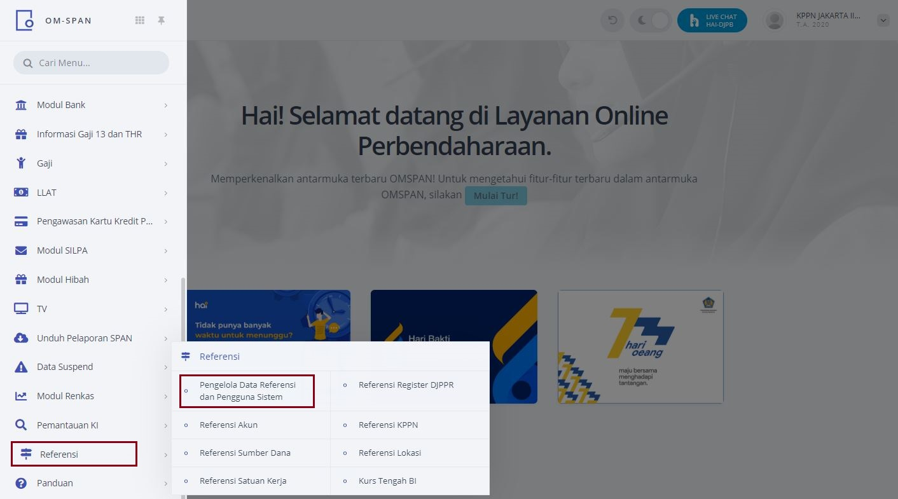
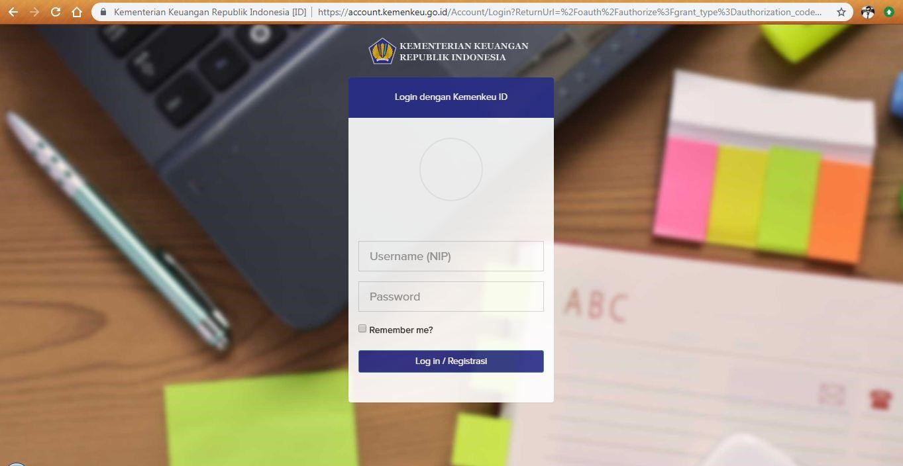

1. Login  
    a. Buka browser dan masuk ke alamat web OMSPAN :  
    	  https://spanint.kemenkeu.go.id/  
    b. User kemudian masuk menggunakan user dan password OMSPAN level KPPN untuk mengakses halaman utama OMSPAN. Kemudian klik Menu  Referensi  Pengelola Data Referensi dan Pengguna Sistem  
       
    c. Selanjutnya User Login ke Aplikasi dengan meng-klik tombol Login yang terdapat di sebelah kanan atas. User mengisi username dan password sebagaimana aplikasi e-performance  
    
    d.	User telah login sebagai UM_USER  
    
