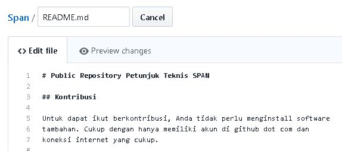
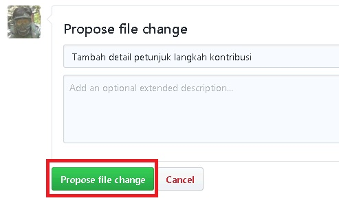
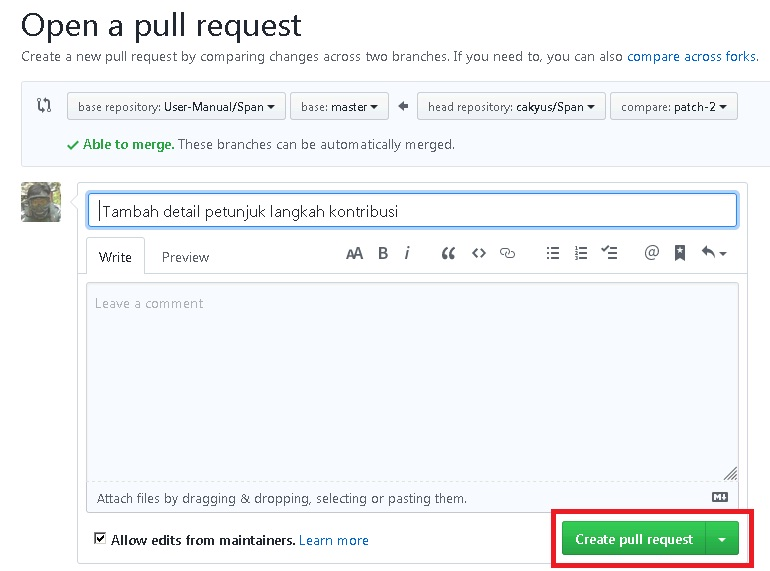
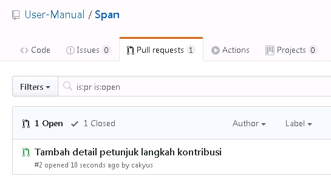

# Public Repository Petunjuk Teknis SPAN

## Kontribusi

Untuk dapat ikut berkontribusi, Anda tidak perlu menginstall software
tambahan. Cukup dengan hanya memiliki akun di github dot com dan
koneksi internet yang cukup.

### Langkah kontribusi

 1. Navigasi ke alamat https://github.com/user-manual/span
 2. Cari berkas yang akan Anda edit dan klik tombol edit.  
    
 3. Edit berkas.  
    
 4. Rekam keterangan perubahan dan klik tombol "Propose file change".  
    
 5. Review perubahan yang akan Anda ajukan kemudian tekan tombol "Create pull request".  
    
 6. Kirim perubahan dengan menekan tekan tombol "Create pull request".  
    
 7. Pada repository akan terlihat pull request yang Anda ajukan.  
    
 8. Selesai.
 
Selanjutnya collaborator akan melakukan review terhadap pull request
yang Anda ajukan.
