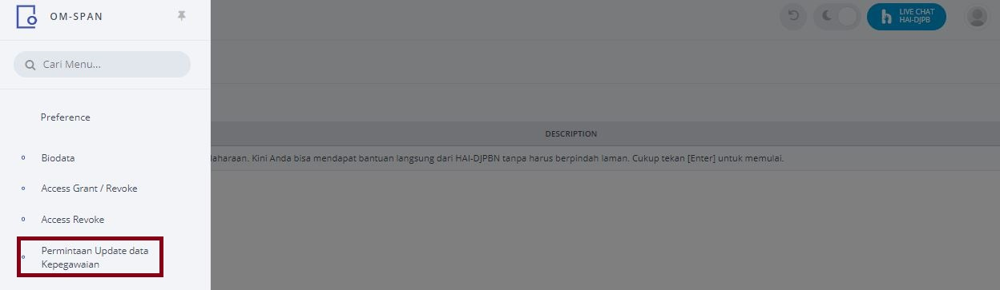
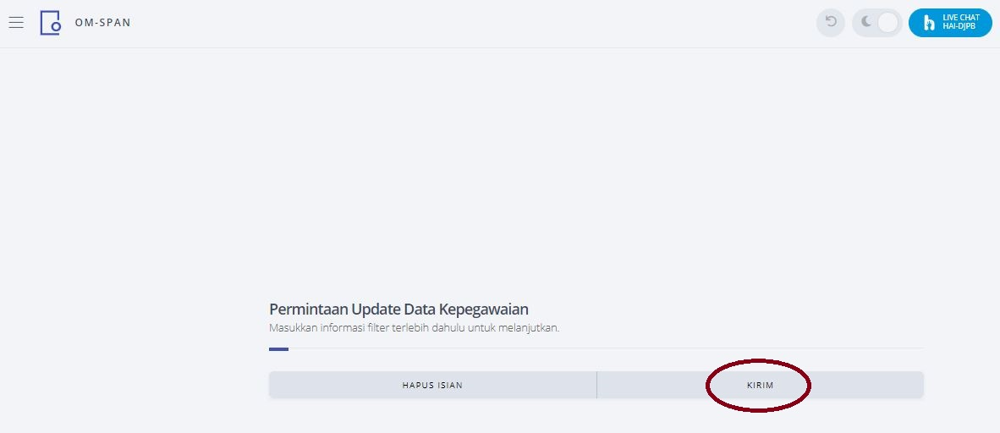

# Sinkronisasi Data HRIS Secara Mandiri
Menu ini sangat berguna untuk mempercepat proses update data HRIS pegawai pemegang user SPAN / yang diajukan untuk menjadi user SPAN di unit kerja vertikal DJPb,
sehingga user dapat merekam perubahan user SPAN tanpa mengalami kendala data tidak valid. Pegawai yang berkepentingan menggunakan menu Update Data Kepegawaian ini
adalah pegawai yang akan diaktifkan sebagai user SPAN di unit kerjanya dan sebaiknya sebelum melakukan perekamanan perubahan user di OMSPAN maka pegawai dimaksud
melakukan Update Data Kepegawaian terlebih dahulu dengan teknis sebagai berikut :

 1. Login dengan responsibility UM_USER.
 2.	Klik menu Permintaan Update Data Kepegawaian  
    
 3. Klik "kirim"
      
 4. Tekan tombol refresh pada browser sampai dengan status request berubah menjadi "C C"  
    
