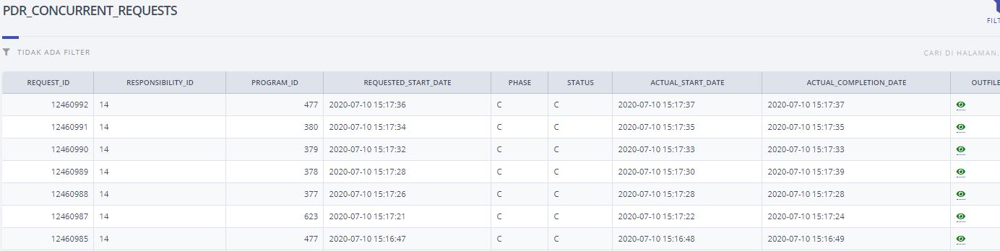

# Sinkronisasi Data HRIS secara mandiri

 1. Login dengan responsibility UM_USER.
 2.	Klik menu Permintaan Update Data Kepegawaian  
    
 3. Klik "kirim"
      
 4. Tunggu status request berubah menjadi "C C"  
    
